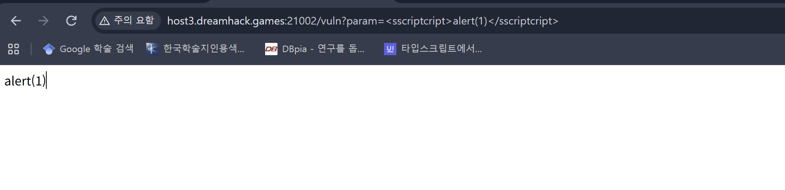
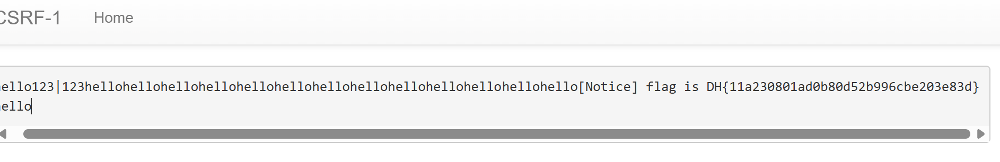
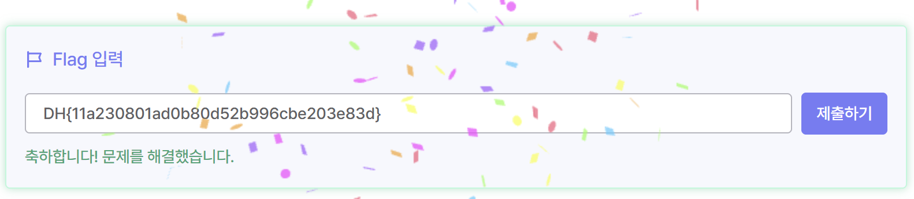

# 1. app.py 분석

## check_csrf

```py
def check_csrf(param, cookie={"name": "name", "value": "value"}):
    url = f"http://127.0.0.1:8000/vuln?param={urllib.parse.quote(param)}"
    return read_url(url, cookie)
```

해당 Chrome 브라우저를 실행 > url 링크 접속 부분
/vuln?param=%3Cscript%3Ealert(1)%3C/script%3E

## /vuln 필터링

```py
def vuln():
    param = request.args.get("param", "").lower()
    xss_filter = ["frame", "script", "on"]
    for _ in xss_filter:
        param = param.replace(_, "*")
    return param
```

코드에서, xss_filter를 통해 "frame", "script", "on"을 필터링하는 것을 확인.

xss가 스크립트 코드를 우회하는 것과 비슷하게 생각하여 script와 on을 우회해보았지만 동작하지 않음.


## /flag

```py
  param = request.form.get("param", "")
```

check_csrf 에서 브라우저에 접속할 때 param 값을 전달한다.

## 관리자 코드

```py
@app.route("/admin/notice_flag")
def admin_notice_flag():
    global memo_text
    if request.remote_addr != "127.0.0.1":
        return "Access Denied"
    if request.args.get("userid", "") != "admin":
        return "Access Denied 2"
    memo_text += f"[Notice] flag is {FLAG}\n"
    return "Ok"
```

### 조건 1.

```py
if request.remote_addr != "127.0.0.1":
       return "Access Denied"
```

요청이 127.0.0.1 에서 출발하는가
맞다면, "Access Denied"

### 조건 2.

```py
if request.args.get("userid", "") != "admin":
       return "Access Denied 2"
   memo_text += f"[Notice] flag is {FLAG}\n"
   return "Ok"
```

userid가 admin인가
맞다면, "OK"

두 조건 만족시,

> memo_text += f"[Notice] flag is {FLAG}\n"
> 코드가 실행된다.

# payload 작성하기

## /vuln 필터링 우회

<script></script> 코드가 필터링 되어있기 때문에 자바스크립트 코드를 실행시키는 대신, 브라우저가 자동으로 요청을 보낼 수 있도록 하는 html 코드르 작성한다.

## 조건 1, 2 만족

userid=admin을 만족해야 하니까 입력값에 userid가 들어간 img태그를 이용한다.

> > 
> > 작성된 payload



