# WarGame web-ssrf

## 문제 개요

Flask로 작성된 **Image Viewer** 서비스다. 사용자가 입력한 URL의 이미지를 서버가 대신 가져와서 보여준다.

- **목표:** SSRF 취약점으로 플래그 획득
- **플래그 위치:** `/app/flag.txt` (서버 내부 파일)

---

## 취약점의 핵심 — 왜 SSRF가 되는가

이 서비스는 "서버가 사용자 대신 URL에 요청을 보내주는" 구조다. 바로 이 지점이 SSRF의 본질이다!

```
[나] --(url=...)--> [Image Viewer 서버] --(서버가 대신 요청)--> [url이 가리키는 곳]
```

사용자가 넣은 주소로 서버가 요청을 보내기 때문에, 외부에서 직접 못 가는 서버 내부(localhost)를 서버를 경유해 찌를 수 있다. 플래그를 주는 내부 서버가 바로 그 대상이다.

---

## 풀이 과정

### 1. 서비스 파악

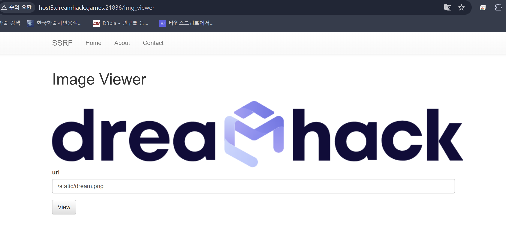
URL을 입력받아 해당 이미지를 출력하는 사이트임을 확인했다.

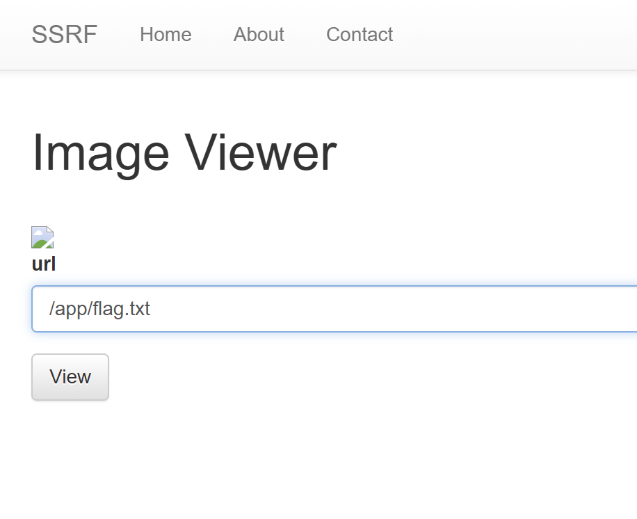
`/app/flag.txt`를 바로 넣어봤지만 안 됐다. → 플래그는 내부 서버가 서빙하는 경로로 접근해야 함을 짐작했다.

### 2. app.py 코드 확인 — 필터 발견

```python
elif ("localhost" in urlp.netloc) or ("127.0.0.1" in urlp.netloc):
    data = open("error.png", "rb").read()
    ...  # 에러 이미지 반환
```

```python
local_host = "127.0.0.1"
```

**막혀있는 이유:** 플래그 서버는 내부(`127.0.0.1`)에서만 접근 가능한데, URL에 `localhost`나 `127.0.0.1` 문자열이 들어가면 무조건 에러 이미지를 띄우도록 필터가 걸려 있다.
→ 정석대로 `127.0.0.1`을 넣으면 차단된다. 이 필터를 우회해야 한다.

### 3. 필터 우회 — IP를 10진수로 변환

`127.0.0.1`을 10진수 표기인 `2130706433` 으로 바꿔서 넣었다.

```
http://2130706433:8000/static/dream.png   → 정상 작동!
```

**우회되는 이유:**

- `127.0.0.1`과 `2130706433`은 컴퓨터 입장에선 완전히 같은 주소이기 때문이다. IPv4 주소는 결국 32비트 정수이고, `127.0.0.1`을 정수로 계산하면:
  - `127×256³ + 0×256² + 0×256 + 1 = 2130706433`
- 브라우저/서버의 네트워크 스택은 이 정수를 똑같은 IP로 해석해서 정상 접속한다.
- 반면 문자열 필터는 `"127.0.0.1"`이라는 글자만 찾기 때문에 `2130706433`은 그냥 통과시킨다.

### 4. 코드 재확인 — 내부 포트 범위 확인

```python
local_port = random.randint(1500, 1800)
```

내부 flag 서버가 **1500~1800 사이 랜덤 포트**로 떠 있다. 즉, 그 범위 안의 포트 하나를 찾아야 한다.
→ `http://2130706433:<포트>/flag.txt` 에서 `<포트>`를 1500~1800으로 브루트포스하면 된다.

### 5. Burp Suite Intruder로 포트 브루트포스

**프록시 셋업:**
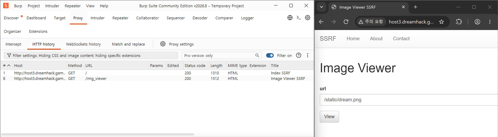

1. Burp → Proxy → **Open browser** (내장 브라우저, 인증서/프록시 자동 설정)
2. 내장 브라우저로 문제 페이지 접속 → Image Viewer 진입
3. url 입력칸에 `http://2130706433:8000/flag.txt` 입력 (아직 View 누르지 않음)

**요청 가로채기:**
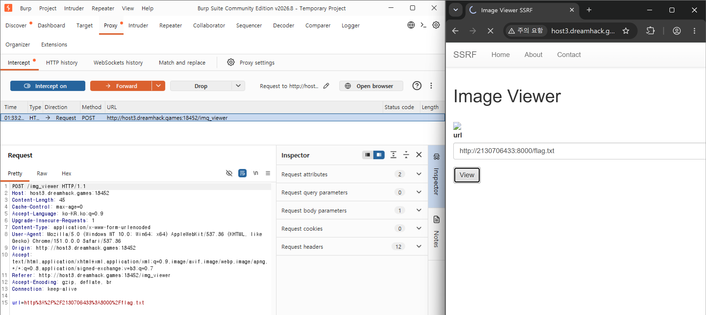 4. Burp Proxy → **Intercept on** 5. 브라우저에서 **View** 클릭 → 요청이 Burp에 걸려 멈춤 6. 요청 본문이 `url=http%3A%2F%2F2130706433%3A8000%2Fflag.txt` 인지 확인 7. 요청 우클릭 → **Send to Intruder**

**Intruder 설정:**
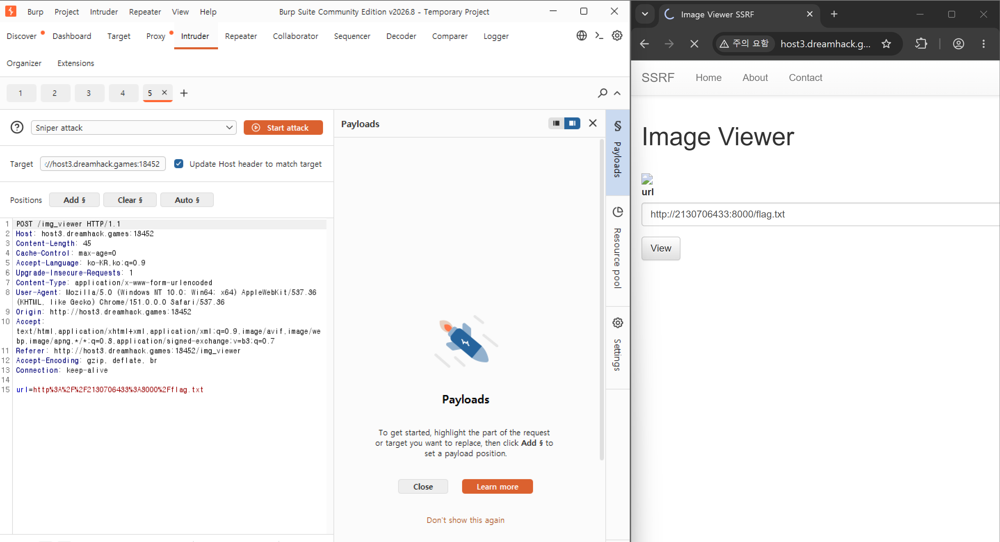
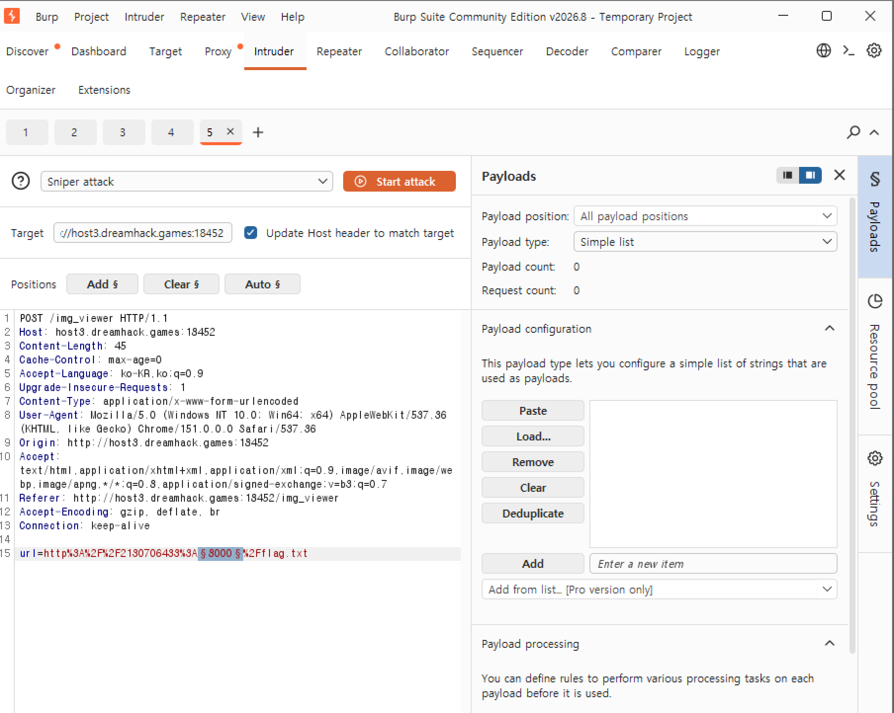 8. Positions 탭 → 포트 숫자 `8000`만 선택 → **Add §**
→ `...2130706433%3A§8000§%2Fflag.txt`

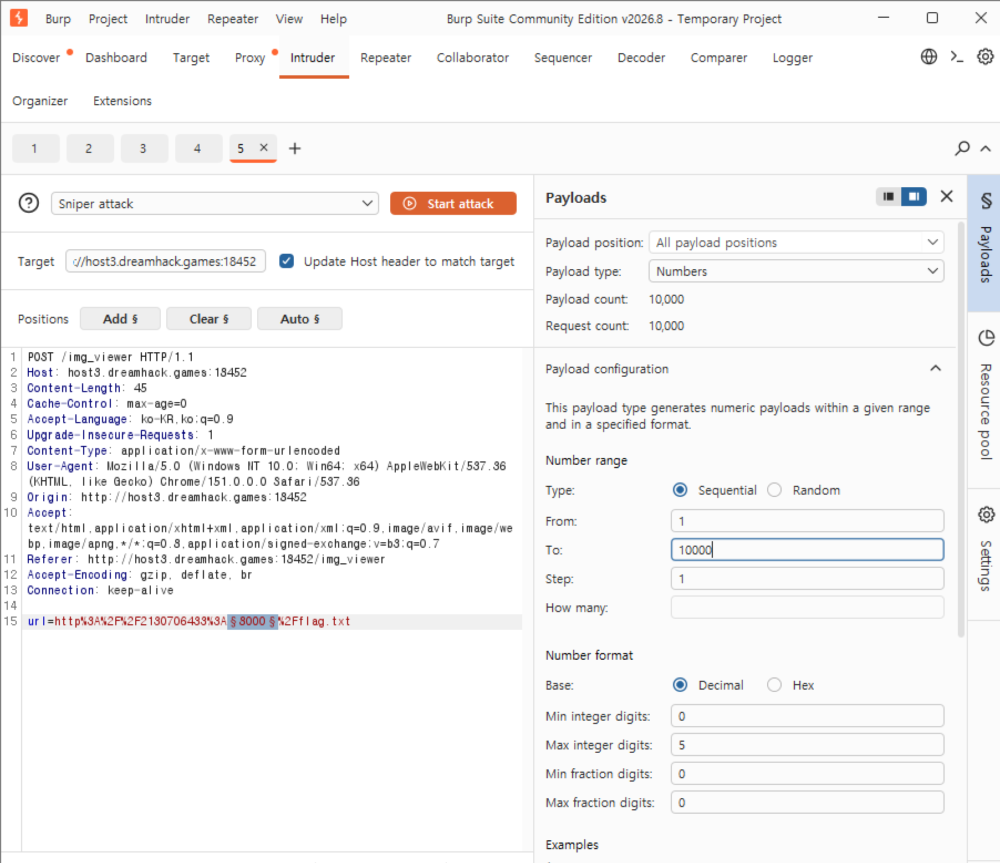 9. Payloads 탭 → Payload type **Numbers**

- **From: 1500, To: 1800, Step: 1** ← 소스에서 확인한 범위!

10. **Start attack**

> 처음엔 범위를 1~10000으로 잡아서 요청이 1만 개나 돼 엄청 느렸다.
> 소스에 `randint(1500, 1800)`이 명시돼 있으므로 범위는 1500~1800(약 300개)으로 좁히는 게 맞다....
> 교훈: 브루트포스 전에 소스코드부터 확인하면 시간이 단축된다ㅎ.ㅎ

### 6. 결과 분석 & 플래그 획득

- 공격 결과 창에서 Length(또는 Status) 컬럼을 클릭해 정렬한다.
  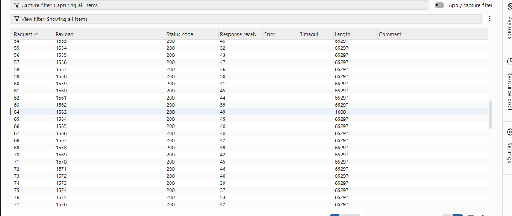
- 닫힌 포트는 전부 동일한 에러 응답(같은 Length)이고, 열린 포트 하나만 응답 크기가 다르다(= flag.txt 내용이 담겨서).
- 그 튀는 행을 클릭 → Response 탭에서 `DH{...}` 플래그 확인.
  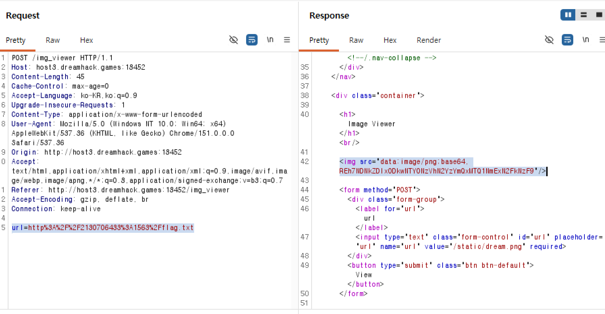
- 15번째 줄에 url=http%3A%2F%2F2130706433%3A1563%2Fflag.txt 확인.
- 42번째 줄  확인.
  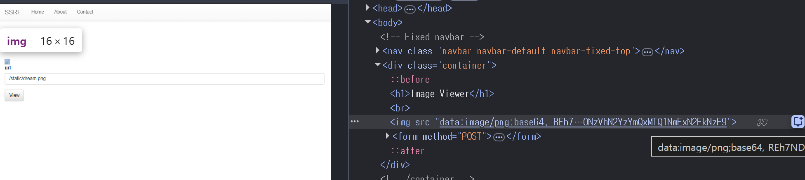
  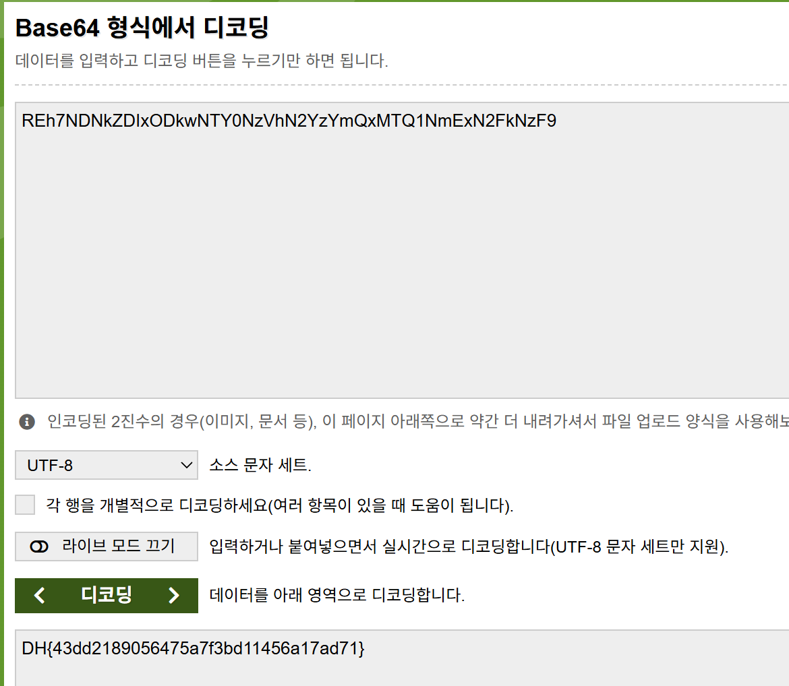
- 디코딩

- 또는 찾은 포트로 브라우저에서 직접: `http://2130706433:1563/flag.txt` → View.
- atob("REh7NDNkZDIxODkwNTY0NzVhN2YzYmQxMTQ1NmExN2FkNzF9") 제출로 디코드하기
- `DH{43dd2189056475a7f3bd11456a17ad71}` 전체를 복사해 드림핵 문제 페이지에 제출.
  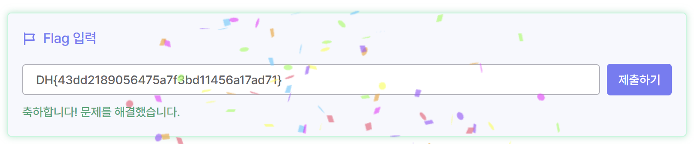

---

## 정리

| 단계                  | 개념             | 왜 중요한가                                     |
| --------------------- | ---------------- | ----------------------------------------------- |
| 서버가 대신 요청      | **SSRF의 본질**  | 외부에서 못 가는 내부 자원을 서버 권한으로 접근 |
| `127.0.0.1` 차단      | 블랙리스트 방어  | 문자열 필터는 불완전한 방어다                   |
| `2130706433`으로 우회 | **IP 표기 변형** | IP는 정수와 같다 → 필터는 뚫리고 접속은 된다    |
| 포트 브루트포스       | 내부 포트 스캐닝 | SSRF로 내부 포트까지 탐색 가능                  |
